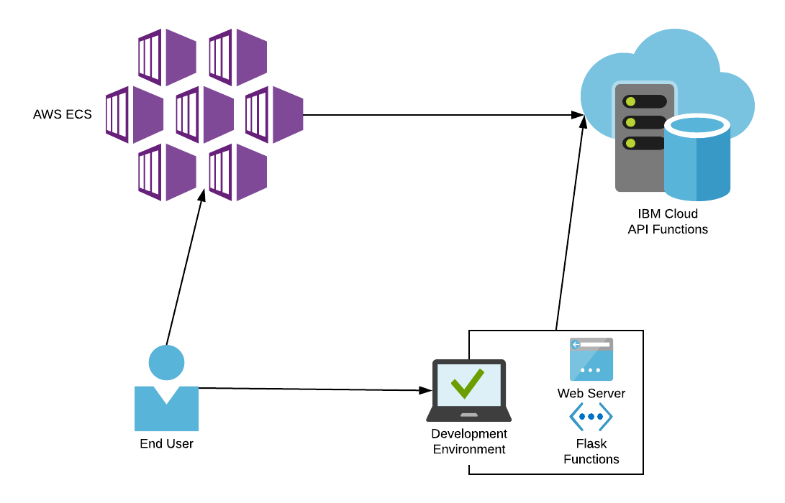

# Marist College - MSCS621: Cloud Computing
## Background
This repository is a final project for Marist College MSCS621 - Cloud Computing for the Fall 2019 Semester.

(C) 2019 Robert Lynch

This application consists of a Flask webpage that connects to an IBM Cloud serverless backend. The application is intended to show users the recommended version level of Juniper Switches. The user can add new switches and their respective firmware.

## Architecture
This application has three components: the web front, development environment, and the API backend. The web front is a packaged Docker container image containing the python3 repository as well as the python files required to run the application. The development end mainly consists of the Flask and HTML files needed to run the application locally with your console. The development environment allows the user to see the interactions with the application via a terminal. Finally, the API backend is an API based on IBM Cloud serverless compute functions connecting IBM's `Cloudant` database to the application.



The logical flow of the application consists of user interaction with either the web front or the development environment. Then, either the web front or the developement environment, interacts with the API to display the correct information for the user.
<br><br>
**Dependencies**<br>
This applications has two main parts, the web front, and the backend APIs. The web front is built on Python using Flask. Flask renders HTML files based on Jinja2 templates. These web files are then served to the end user. The API backend is served via IBM's serverless functions. NodeJS functions are ran when information is requested.

## Deployment
The following are required to run the application:<br>
**Web Front**<br>
Docker [Installation Guide](https://docs.docker.com/v17.09/engine/installation/)<br>
`docker run -d -p 5000:5000 robertlynch3/mscs621-fall2019-project`<br>
<br>
[Running on AWS](https://www.theserverside.com/video/How-to-deploy-Docker-Hub-hosted-microservices-in-AWS-ECS)
<br><br>

**Development Environment**<br>
Python3 [Installation Guide](https://realpython.com/installing-python/)<br>
Flask<br>
Requests<br><br>
_For Flask and requests:_<br>
`sudo pip install requirements.txt`
<br><br>

**API Backend**<br>
[Follow instructions on IBM Cloud](https://cloud.ibm.com/docs/tutorials?topic=solution-tutorials-serverless-api-webapp)
Edit the URL in the `app/data.py` file to the correct URL for your function.
<br><br>

## API Information
The API can be called upon with basic curl commands. The API has get and post functions.
<br><br>
**Example**<br>
GET:
```
curl --request GET \
  --url APIURL \
  --header 'accept: application/json'
```
POST:
```
curl --request POST \
  --url APIURL \
  --header 'accept: application/json' \
  --header 'content-type: application/json' \
  --data '{"name":"testing","slug":"QFX-5200","recommendedVersion":"junos 18.1R3-S6"}'
```

## Acknowledgments
This project was developed with help from Marist College iLearn resources, Youtube, and IBM resources.
